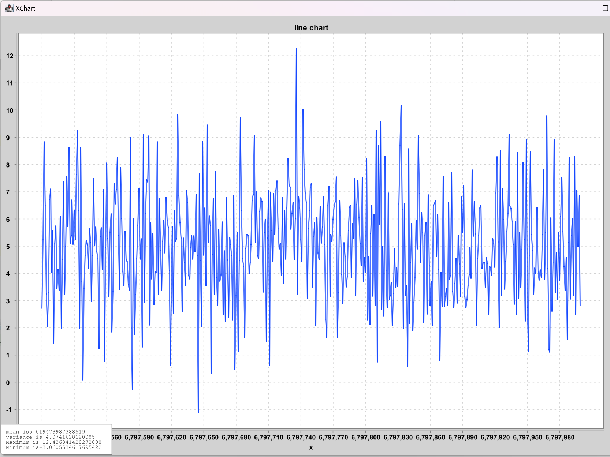

# 分布式计算第三次作业

姓名:周宏伟
学号:20009200773

## 环境

JDK: Eclipse Temurin Version 17.0.6
Maven 3.8.1

## 说明

先运行Producer部分,再运行Calculator部分,再运行Draw部分

## 实现

在producer中随机生成符合高斯分布的随机数,方差和均值可调,将其发布到queue_gauss队列中.
由calculator部分从队列中得到消息并且计算最近N个随机数的均值,方差,和历史上的最大最小值,这里用了
commons-math3这个来计算上面的数值.将这些东西打包放进DrawerData这个类中,发送到消息队列queue_drawer.
用Draw部分从队列中拿出消息.Draw中用了xchart这个库来画图.

## 结果图

